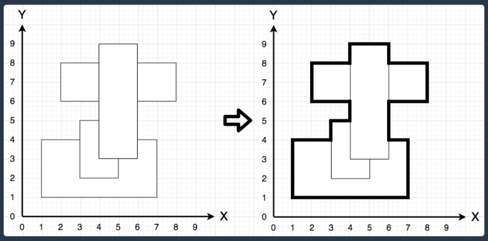
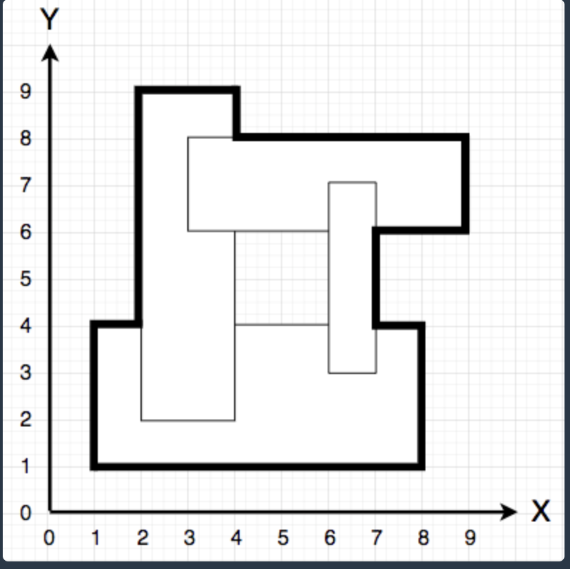
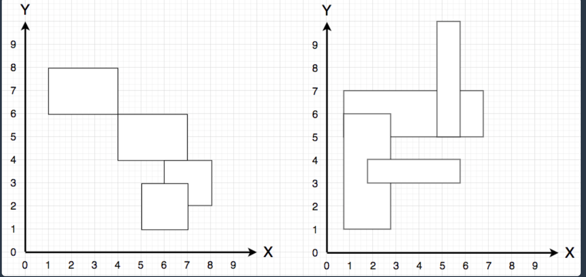
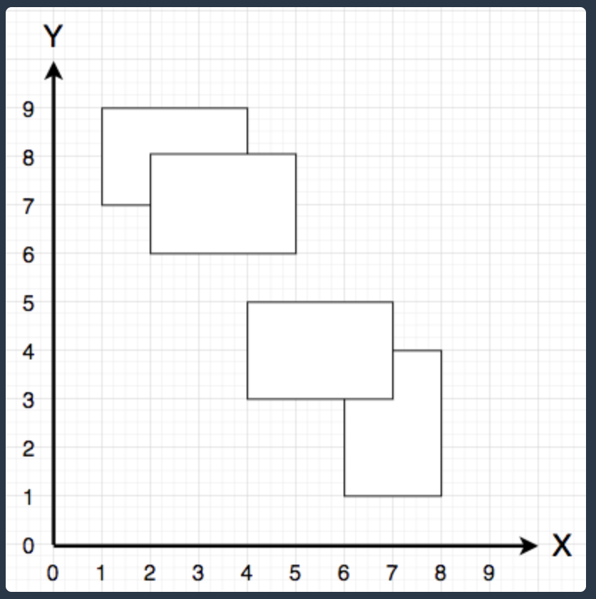
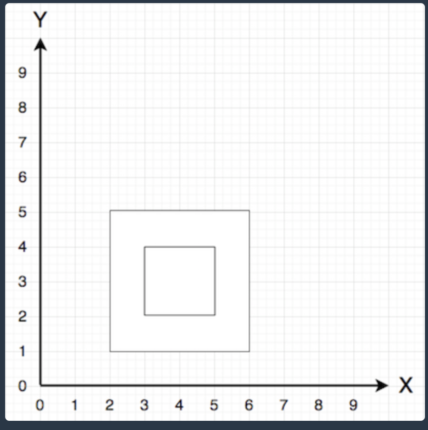
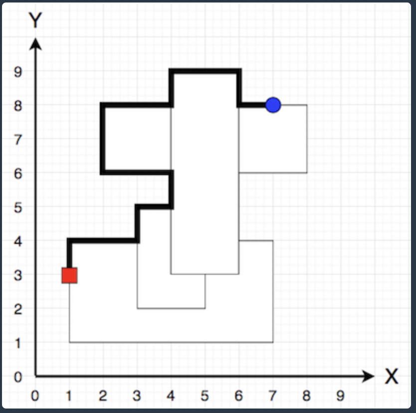
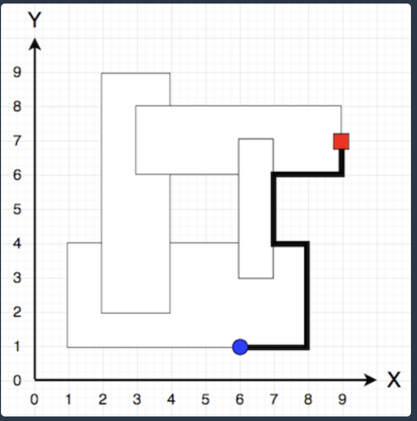
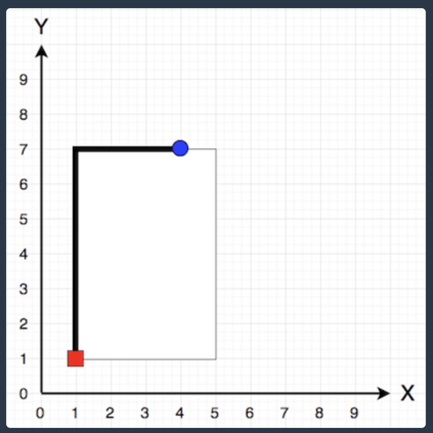

## 아이템 줍기

### 문제 설명
- 다음과 같은 다각형 모양 지형에서 캐릭터가 아이템을 줍기 위해 이동하려 합니다.



- 지형은 각 변이 x축, y축과 평행한 직사각형이 겹쳐진 형태로 표현하며, 캐릭터는 이 다각형의 둘레(굵은 선)를 따라서 이동합니다.
- 만약 직사각형을 겹친 후 다음과 같이 중앙에 빈 공간이 생기는 경우, 다각형의 가장 바깥쪽 테두리가 캐릭터의 이동 경로가 됩니다.



- 단, 서로 다른 두 직사각형의 x축 좌표 또는 y축 좌표가 같은 경우는 없습니다.



- 즉, 위 그림처럼 서로 다른 두 직사각형이 꼭짓점에서 만나거나, 변이 겹치는 경우 등은 없습니다.

- 다음 그림과 같이 지형이 2개 이상으로 분리된 경우도 없습니다.



- 한 직사각형이 다른 직사각형 안에 완전히 포함되는 경우 또한 없습니다.



- 지형을 나타내는 직사각형이 담긴 2차원 배열 rectangle, 초기 캐릭터의 위치 characterX, characterY, 아이템의 위치 itemX, itemY가 solution 함수의 매개변수로 주어질 때, 캐릭터가 아이템을 줍기 위해 이동해야 하는 가장 짧은 거리를 return 하도록 solution 함수를 완성해주세요.

### 제한사항
- rectangle의 세로(행) 길이는 1 이상 4 이하입니다.
- rectangle의 원소는 각 직사각형의 [좌측 하단 x, 좌측 하단 y, 우측 상단 x, 우측 상단 y] 좌표 형태입니다.
- 직사각형을 나타내는 모든 좌표값은 1 이상 50 이하인 자연수입니다.
- 서로 다른 두 직사각형의 x축 좌표, 혹은 y축 좌표가 같은 경우는 없습니다.
- 문제에 주어진 조건에 맞는 직사각형만 입력으로 주어집니다.
- charcterX, charcterY는 1 이상 50 이하인 자연수입니다.
- 지형을 나타내는 다각형 테두리 위의 한 점이 주어집니다.
- itemX, itemY는 1 이상 50 이하인 자연수입니다.
- 지형을 나타내는 다각형 테두리 위의 한 점이 주어집니다.
- 캐릭터와 아이템의 처음 위치가 같은 경우는 없습니다.
- 전체 배점의 50%는 직사각형이 1개인 경우입니다.
- 전체 배점의 25%는 직사각형이 2개인 경우입니다.
- 전체 배점의 25%는 직사각형이 3개 또는 4개인 경우입니다.

### 입출력 예
|rectangle|characterX|characterY|itemX|itemY|result|
|--|--|--|--|--|--|
|[[1,1,7,4],[3,2,5,5],[4,3,6,9],[2,6,8,8]]|1|3|	7|8|17|
|[[1,1,8,4],[2,2,4,9],[3,6,9,8],[6,3,7,7]]|9|7|6|1|11|
|[[1,1,5,7]]|1|1|4|7|9|
|[[2,1,7,5],[6,4,10,10]]|3|1|7|10|15|
|[[2,2,5,5],[1,3,6,4],[3,1,4,6]]|1|4|6|3|10|

### 입출력 예 설명
- 입출력 예 #1



- 캐릭터 위치는 (1, 3)이며, 아이템 위치는 (7, 8)입니다. 위 그림과 같이 굵은 선을 따라 이동하는 경로가 가장 짧습니다.

### 입출력 예 #2



- 캐릭터 위치는 (9, 7)이며, 아이템 위치는 (6, 1)입니다. 위 그림과 같이 굵은 선을 따라 이동하는 경로가 가장 짧습니다.

### 입출력 예 #3



- 캐릭터 위치는 (1, 1)이며, 아이템 위치는 (4, 7)입니다. 
- 위 그림과 같이 굵은 선을 따라 이동하는 경로가 가장 짧습니다.

### 입출력 예 #4, #5

설명 생략

### 해설
[해설](https://arinnh.tistory.com/88)

### 작성 답안
```
import java.util.Queue;
import java.util.LinkedList;

class Solution {
    static int[][] map;
    static int answer;
    //character->item(목표 포인트)
    public int solution(int[][] rectangle, int characterX, int characterY, int itemX, int itemY) {
        answer=0;
        
        //1) map을 만든다.
        map= new int[101][101];
        
        //2) 좌표에 따라 map에 값을 넣을건데, 테두리에만 1을 넣을것이다.(*좌표는 두배로)
        for(int i=0; i<rectangle.length; i++){
            fill(2*rectangle[i][0], 2*rectangle[i][1], 2*rectangle[i][2], 2*rectangle[i][3]);
        }
        
        //3) bfs로 테두리 따라 양쪽으로 가보고 min값 채택
        bfs(2*characterX, 2*characterY, 2*itemX, 2*itemY);
        
        return answer/2;
    }
    
    //x1,y1,x2,y2 => (x1,y1)~(x2,y1), (x1,y2)~(x2,y2), (x1,y1)~(x1,y2), (x2,y1)~(x2,y2)
    //편하게 x2 해준 좌표를 받는다.
    public void fill(int x1, int y1, int x2, int y2){
        for(int i=x1; i<=x2; i++){
            for(int j=y1; j<=y2; j++){
                if(map[i][j]==2) continue;
                map[i][j]=2;
                if(i==x1||i==x2||j==y1||j==y2){
                    map[i][j]=1;
                }
            }
        }
    }//fill
    
    static int[] dx= {-1, 0, 0, 1};
    static int[] dy= {0, -1, 1, 0};
    public void bfs(int startx, int starty, int itemx, int itemy){
        boolean[][] visited= new boolean[101][101];
        Queue<Integer> queue= new LinkedList<>();
        queue.add(startx);
        queue.add(starty);
        
        while(!queue.isEmpty()){
            int x= queue.poll();
            int y= queue.poll();
            
            for(int i=0; i<4; i++){
                int nx= x+dx[i];
                int ny= y+dy[i];
                if(!check(nx, ny)) continue; //범위 아웃
                if(map[nx][ny]!=1||visited[nx][ny]) continue;
                
                //map[nx][ny]==2이고 방문한적없음
                map[nx][ny]=map[x][y]+1;
                if(nx==itemx&&ny==itemy){ //목표점 도달
                    answer= (answer==0)? map[nx][ny]:Math.min(answer,map[nx][ny]);
                    continue;
                }
                visited[nx][ny]= true;
                queue.add(nx);
                queue.add(ny);
            }
        }
    }//bfs
    
    public boolean check(int x, int y){
        if(x<0||y<0||x>100||y>100) return false;
        return true;
    }
}
```