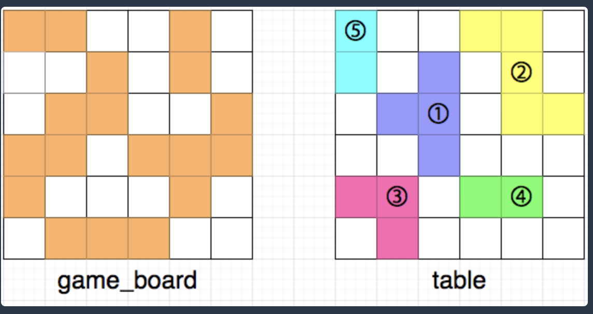
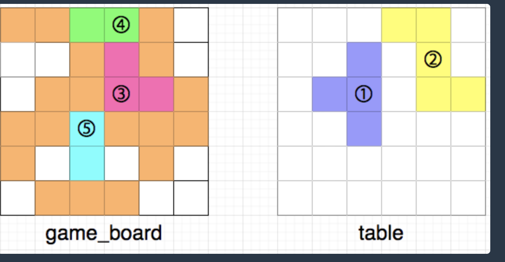
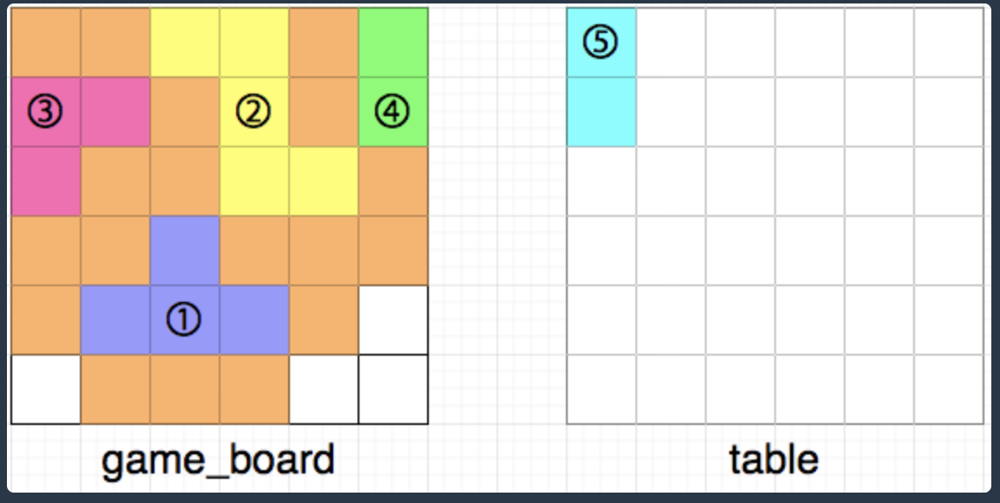
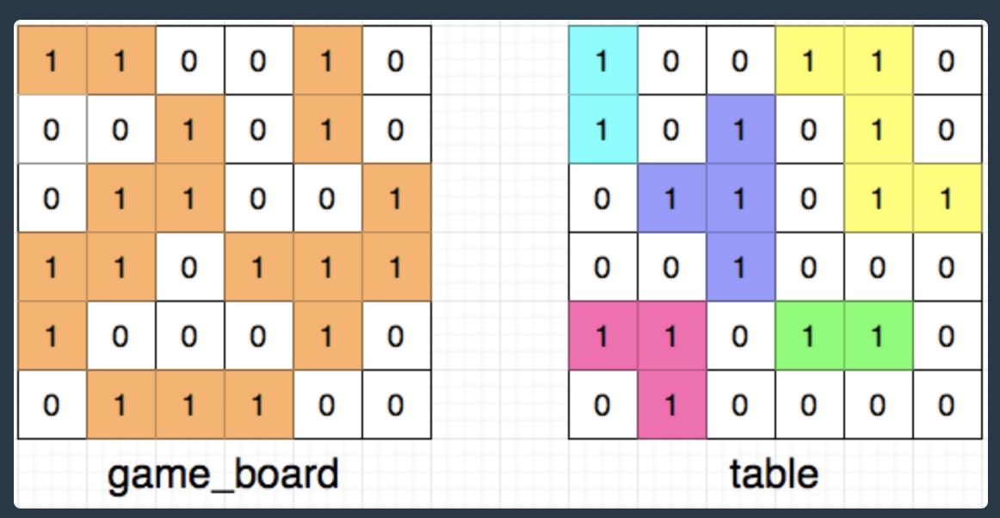

## 퍼즐 조각 채우기
### 문제 설명
- 테이블 위에 놓인 퍼즐 조각을 게임 보드의 빈 공간에 적절히 올려놓으려 합니다. 
- 게임 보드와 테이블은 모두 각 칸이 1x1 크기인 정사각 격자 모양입니다. 
- 이때, 다음 규칙에 따라 테이블 위에 놓인 퍼즐 조각을 게임 보드의 빈칸에 채우면 됩니다.

- 조각은 한 번에 하나씩 채워 넣습니다.
- 조각을 회전시킬 수 있습니다.
- 조각을 뒤집을 수는 없습니다.
- 게임 보드에 새로 채워 넣은 퍼즐 조각과 인접한 칸이 비어있으면 안 됩니다.
- 다음은 퍼즐 조각을 채우는 예시입니다.



- 위 그림에서 왼쪽은 현재 게임 보드의 상태를, 오른쪽은 테이블 위에 놓인 퍼즐 조각들을 나타냅니다. 테이블 위에 놓인 퍼즐 조각들 또한 마찬가지로 [상,하,좌,우]로 인접해 붙어있는 경우는 없으며, 흰 칸은 퍼즐이 놓이지 않은 빈 공간을 나타냅니다. 모든 퍼즐 조각은 격자 칸에 딱 맞게 놓여있으며, 격자 칸을 벗어나거나, 걸쳐 있는 등 잘못 놓인 경우는 없습니다.

- 이때, 아래 그림과 같이 3,4,5번 조각을 격자 칸에 놓으면 규칙에 어긋나므로 불가능한 경우입니다.



- 3번 조각을 놓고 4번 조각을 놓기 전에 위쪽으로 인접한 칸에 빈칸이 생깁니다.
- 5번 조각의 양 옆으로 인접한 칸에 빈칸이 생깁니다.
- 다음은 규칙에 맞게 최대한 많은 조각을 게임 보드에 채워 넣은 모습입니다.



- 최대한 많은 조각을 채워 넣으면 총 14칸을 채울 수 있습니다.

- 현재 게임 보드의 상태 game_board, 테이블 위에 놓인 퍼즐 조각의 상태 table이 매개변수로 주어집니다. 규칙에 맞게 최대한 많은 퍼즐 조각을 채워 넣을 경우, 총 몇 칸을 채울 수 있는지 return 하도록 solution 함수를 완성해주세요.

### 제한사항
- 3 ≤ game_board의 행 길이 ≤ 50
- game_board의 각 열 길이 = game_board의 행 길이
즉, 게임 보드는 정사각 격자 모양입니다.
- game_board의 모든 원소는 0 또는 1입니다.
- 0은 빈칸, 1은 이미 채워진 칸을 나타냅니다.
- 퍼즐 조각이 놓일 빈칸은 1 x 1 크기 정사각형이 최소 1개에서 - 최대 6개까지 연결된 형태로만 주어집니다.
- table의 행 길이 = game_board의 행 길이
- table의 각 열 길이 = table의 행 길이
- 즉, 테이블은 game_board와 같은 크기의 정사각 격자 모양입니다.
- table의 모든 원소는 0 또는 1입니다.
- 0은 빈칸, 1은 조각이 놓인 칸을 나타냅니다.
- 퍼즐 조각은 1 x 1 크기 정사각형이 최소 1개에서 최대 6개까지 연결된 형태로만 주어집니다.
- game_board에는 반드시 하나 이상의 빈칸이 있습니다.
- table에는 반드시 하나 이상의 블록이 놓여 있습니다.

### 입출력|예
|game_board|table|result|
|--|--|--|
[[1,1,0,0,1,0],[0,0,1,0,1,0],[0,1,1,0,0,1],[1,1,0,1,1,1],[1,0,0,0,1,0],[0,1,1,1,0,0]]|[[1,0,0,1,1,0],[1,0,1,0,1,0],[0,1,1,0,1,1],[0,0,1,0,0,0],[1,1,0,1,1,0],[0,1,0,0,0,0]]|14
[[0,0,0],[1,1,0],[1,1,1]]|[[1,1,1],[1,0,0],[0,0,0]]|0

### 입출력 예 설명
입출력 예 #1

- 입력은 다음과 같은 형태이며, 문제의 예시와 같습니다.



### 해설
[해설](https://velog.io/@front/%ED%94%84%EB%A1%9C%EA%B7%B8%EB%9E%98%EB%A8%B8%EC%8A%A4-%ED%8D%BC%EC%A6%90-%EC%A1%B0%EA%B0%81-%EC%B1%84%EC%9A%B0%EA%B8%B0-%EC%9C%84%ED%81%B4%EB%A6%AC-%EC%B1%8C%EB%A6%B0%EC%A7%80-3%EC%A3%BC%EC%B0%A8)

### 작성 답안
```
import java.util.ArrayList;
import java.util.Arrays;
import java.util.Collections;
import java.util.LinkedList;
import java.util.Queue;

class Point implements Comparable<Point> {
    int x;
    int y;

    public Point(int x, int y) {
        this.x = x;
        this.y = y;
    }

    // 오름차순 정렬
    @Override
    public int compareTo(Point o) {
        if (this.x == o.x) {
            return this.y - o.y;
        }

        return this.x - o.x;
    }
}

public class Solution {

    static int[] dx = {-1, 0 , 1, 0}; // 상하
    static int[] dy = {0, -1, 0, 1}; // 좌우

    static int boardSize;
    static ArrayList<ArrayList<Point>> empty = new ArrayList<>(); // 게임 보드의 빈 공간 저장
    static ArrayList<ArrayList<Point>> block = new ArrayList<>(); // 테이블의 블록 저장
    static boolean[][] visited;

    public static void main(String[] args) {
        int[][] g1 = {{1, 1, 0, 0, 1, 0}, {0, 0, 1, 0, 1, 0}, {0, 1, 1, 0, 0, 1},
                {1, 1, 0, 1, 1, 1}, {1, 0, 0, 0, 1, 0}, {0, 1, 1, 1, 0, 0}};
        int[][] t1 = {{1, 0, 0, 1, 1, 0}, {1, 0, 1, 0, 1, 0}, {0, 1, 1, 0, 1, 1},
                {0, 0, 1, 0, 0, 0}, {1, 1, 0, 1, 1, 0}, {0, 1, 0, 0, 0, 0}};

        System.out.println(solution(g1, t1));
    }

    public static int solution(int[][] game_board, int[][] table) {
        boardSize = game_board.length;

        visited = new boolean[boardSize][boardSize];

        // 게임 보드의 빈 공간 체크
        for (int i = 0; i < boardSize; i++) {
            for (int j = 0; j <boardSize; j++) {
                if (game_board[i][j] == 0 && !visited[i][j]) {
                    empty.add(check(game_board, i, j, 0));
                }
            }
        }

        for (int i = 0; i < boardSize; i++) {
            Arrays.fill(visited[i], false);
        }

        // 테이블의 블록 체크
        for (int i = 0; i < boardSize; i++) {
            for (int j = 0; j < boardSize; j++) {
                if (table[i][j] == 1 && !visited[i][j])
                    block.add(check(table, i, j, 1));
            }
        }


    boolean[] visitedBoard = new boolean[empty.size()];
    int answer = 0;

    // 게임 보드의 빈 공간과 테이블의 블록만큼 반복하면서 빈 공간에 블록을 채움
        for (int i = 0; i < block.size(); i++) {
        ArrayList<Point> blockCheck = block.get(i);

        for (int j = 0; j < empty.size(); j++) {
            ArrayList<Point> emptyCheck = empty.get(j);

            // 빈 공간과 블록의 개수가 같고 방문한 적이 없는 곳일 경우
            if (emptyCheck.size() == blockCheck.size() && !visitedBoard[j]) {
                // 빈 공간에 블록이 들어가는지 확인
                if (isRotate(emptyCheck, blockCheck)) {
                    // 빈 공간에 블록이 들어간다면 answer에 블록 개수를 더함
                    answer += blockCheck.size();
                    visitedBoard[j] = true;
                    break;
                }
            }
        }
    }

        return answer;
}

    // 게임 보드의 빈 공간과 테이블의 블록을 찾아내는 메소드
    // 탐색할 배열, 탐색할 인덱스, 게임보드와 테이블 구분하는 변수
    public static ArrayList<Point> check(int[][] board, int x, int y, int type) {
        Queue<Point> q = new LinkedList<>();
        ArrayList<Point> result = new ArrayList<>();

        q.add(new Point(x, y));
        visited[x][y] = true;

        // 빈 공간이나 블록의 첫 번째 좌표를 (0, 0)으로 함
        result.add(new Point(0, 0));

        while (!q.isEmpty()) {
            Point cur = q.poll();

            for (int i = 0; i < 4; i++) {
                int nx = cur.x + dx[i];
                int ny = cur.y + dy[i];

                if (nx >= 0 && nx < boardSize && ny >= 0 && ny < boardSize) {
                    if (!visited[nx][ny] && board[nx][ny] == type) {
                        q.add(new Point(nx, ny));
                        visited[nx][ny] = true;

                        // 기준이 (0, 0)이기 때문에 (nx - x, ny - y)를 리스트에 넣음
                        result.add(new Point(nx - x, ny - y));
                    }
                }

            }
        }

        Collections.sort(result);

        return result;
    }

    // 블록을 회전시키면서 게임 보드에 들어가는지 확인하는 메소드
    public static boolean isRotate(ArrayList<Point> empty, ArrayList<Point> block) {
        // 90도씩 회전 시키기
        for (int i = 0; i < 4; i++) {
            int zeroX = block.get(0).x;
            int zeroY = block.get(0).y;

            // 회전시키면서 좌표가 달라지기 때문에 다시 (0, 0)을 기준으로 블록 좌표를 변경
            for (int j = 0; j < block.size(); j++) {
                block.get(j).x -= zeroX;
                block.get(j).y -= zeroY;
            }

            boolean isCollect = true;

            for (int j = 0; j < empty.size(); j++) {
                Point emptyPoint = empty.get(j);
                Point blockPoint = block.get(j);

                // 블록 좌표가 빈 공간의 좌표와 하나라도 다르면 중단
                if (emptyPoint.x != blockPoint.x || emptyPoint.y != blockPoint.y) {
                    isCollect = false;
                    break;
                }
            }

            if (isCollect) {
                return true;
            }
            else {
                // 90도 회전 : (x, y) -> (y, -x)
                for (int j = 0; j < block.size(); j++) {
                    int temp = block.get(j).x;

                    block.get(j).x = block.get(j).y;
                    block.get(j).y = -temp;
                }

                Collections.sort(block);
            }

        }

        return false;
    }

}
```