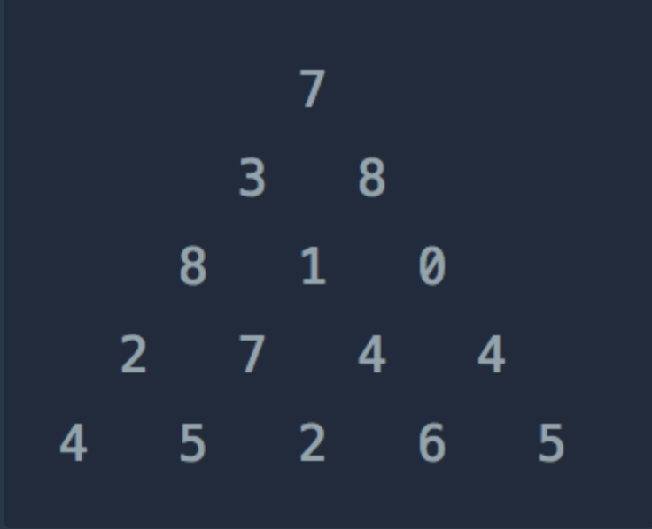

## 정수 삼각형
### 문제 설명



- 위와 같은 삼각형의 꼭대기에서 바닥까지 이어지는 경로 중, 거쳐간 숫자의 합이 가장 큰 경우를 찾아보려고 합니다. 
- 아래 칸으로 이동할 때는 대각선 방향으로 한 칸 오른쪽 또는 왼쪽으로만 이동 가능합니다. 예를 들어 3에서는 그 아래칸의 8 또는 1로만 이동이 가능합니다.
- 삼각형의 정보가 담긴 배열 triangle이 매개변수로 주어질 때, 거쳐간 숫자의 최댓값을 return 하도록 solution 함수를 완성하세요.

### 제한사항
- 삼각형의 높이는 1 이상 500 이하입니다.
- 삼각형을 이루고 있는 숫자는 0 이상 9,999 이하의 정수입니다.

### 입출력 예
|triangle|result|
|[[7], [3, 8], [8, 1, 0], [2, 7, 4, 4], [4, 5, 2, 6, 5]]|30|

### 해설
[해설 링크](https://easybrother0103.tistory.com/133)

### 작성답안

```
class Solution {
    public int solution(int[][] triangle) {
        int[][] dp = new int[triangle.length][triangle.length];
        dp[0][0] = triangle[0][0];
        
        for (int i = 1; i < triangle.length; i++) {
            // 맨 왼쪽
            dp[i][0] = dp[i - 1][0] + triangle[i][0];
            
            // 중간
            for (int j = 1; j <= i; j++) {
                dp[i][j] = Math.max(dp[i - 1][j], dp[i - 1][j - 1]) + triangle[i][j];
            }
            
            // 맨 오른쪽
            dp[i][i] = dp[i - 1][i - 1] + triangle[i][i];
        }
        
        int answer = 0;
        
        for (int i = 0; i < triangle.length; i++) {
            answer = Math.max(answer, dp[triangle.length - 1][i]);
        }
        
        return answer;
    }
}
```